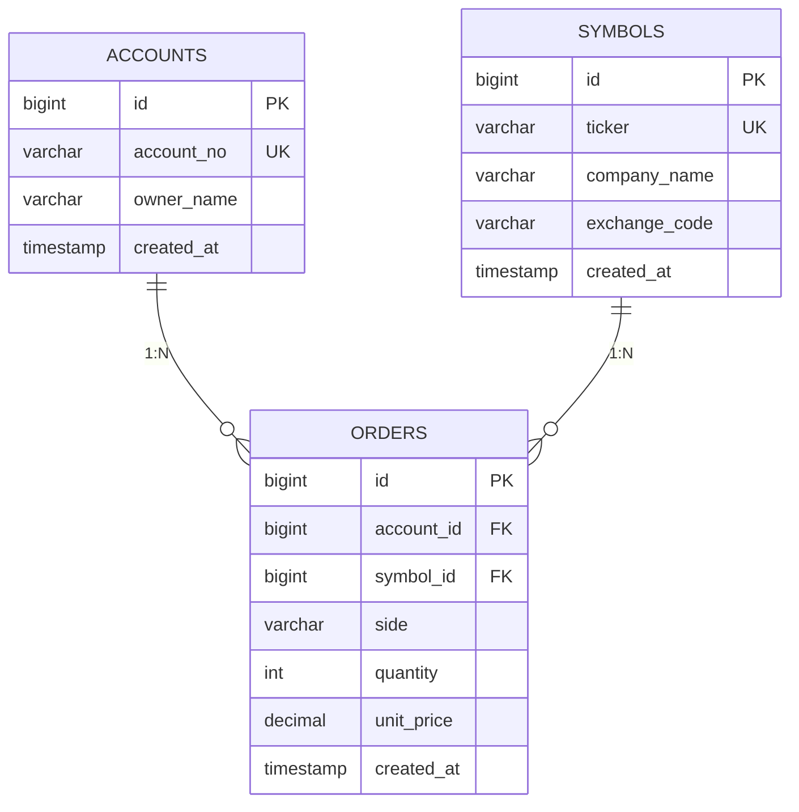

# 資料庫設計 — TradingRDBS

## 存取鏈

```
Controller → Service (@Transactional) → Repository → H2 / PostgreSQL
```

## ER 圖（3NF）



## 表清單

| 表 | UK | 索引 |
|----|-----|------|
| accounts | account_no | PK id |
| symbols | ticker | PK id |
| orders | — | account_id, symbol_id |

## Entity 對照

| Java | 表 |
|------|-----|
| `Account` | accounts |
| `Symbol` | symbols |
| `Order` | orders |

## 3NF 檢核

| 檢查 | 結果 |
|------|------|
| orders 無 owner_name | ✓ |
| orders 無 ticker / company_name | ✓ |
| 帳戶更新 owner_name 不需改 orders | ✓ |
| 標的更新 company_name 不需改 orders | ✓ |

## 環境

| Profile | JDBC |
|---------|------|
| dev/test | `jdbc:h2:mem:rdbs;MODE=PostgreSQL` |
| prod | `DB_URL` 環境變數 → PostgreSQL |

設定：`src/main/resources/application.yml`

## SQL 驗證

H2 Console 登入後執行 [docs/sql/01-schema-verify.sql](sql/01-schema-verify.sql)
